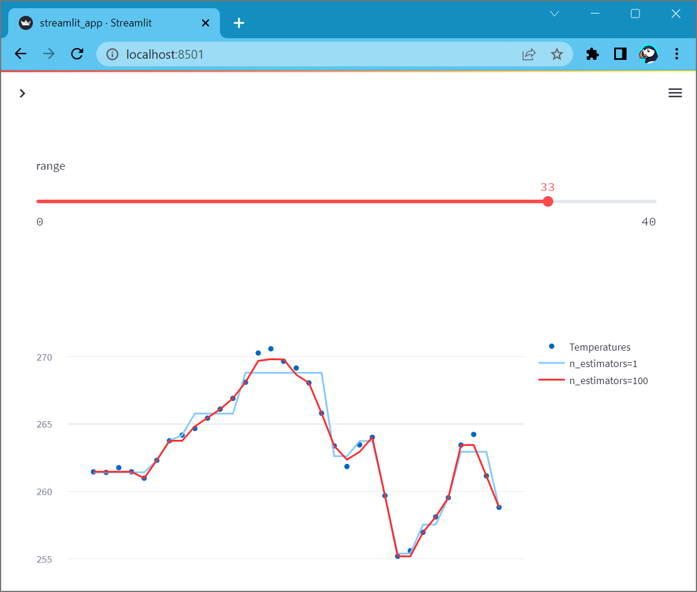

# Weather app [](https://share.streamlit.io/slevin48/weather_app)


## Deploy Streamlit using Docker

https://docs.streamlit.io/knowledge-base/tutorials/deploy/docker

```
docker build -t weather .
```

```
docker run --rm -it -p 8501:8501 weather
```

